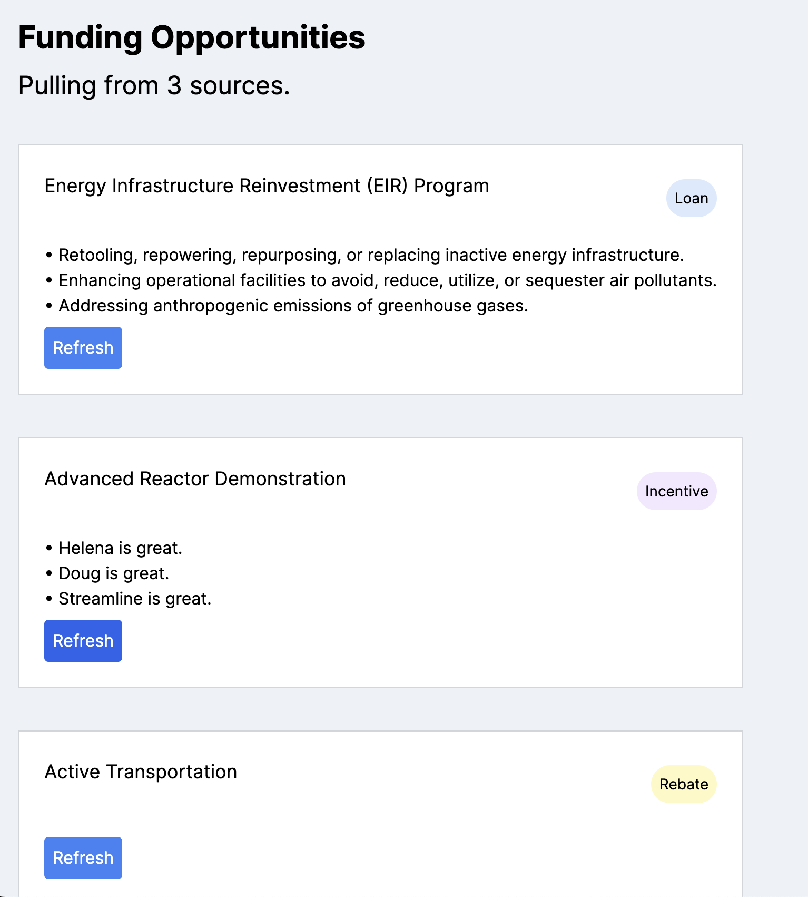

# Recreating Streamline's Discover tool
https://app.streamlineclimate.com/discover 



Thanks to Eric H for his [grant-eligibility project](https://github.com/EricHasegawa/grant-eligibility) that gave me some baseline nextjs and openai setup!
# Environment variables
add your `OPENAI_API_KEY` to `.env.local` or `.env`

## Getting Started

First, run the development server:

```bash
npm run dev
# or
yarn dev
# or
pnpm dev
# or
bun dev
```

Open [http://localhost:3000](http://localhost:3000) with your browser to see the result.

You can start editing the page by modifying `app/page.tsx`. The page auto-updates as you edit the file.

This project uses [`next/font`](https://nextjs.org/docs/basic-features/font-optimization) to automatically optimize and load Inter, a custom Google Font.
