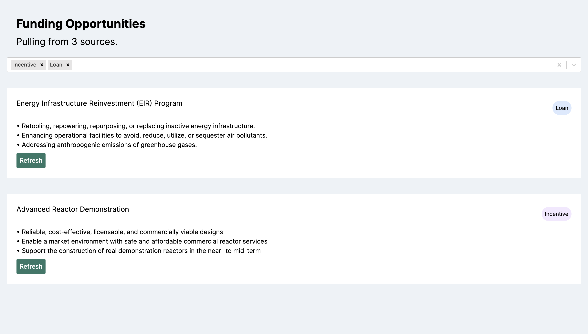

# Recreating Streamline's Discover tool
Live app
https://grants-app-puce.vercel.app/

Streamline's actual Discover tool
https://app.streamlineclimate.com/discover 

An old screenshot before I connected with openai. 


Thanks to Eric H for his [grant-eligibility project](https://github.com/EricHasegawa/grant-eligibility) that gave me some baseline nextjs and openai setup!

## OpenAI feature
When you click refresh (streamline's green), a request goes to the openai api to get a summary in three bullet points, which are displayed per card.
Of course, this query would not be triggered from a user as it is quite slow and is something that can be saved in a data pipeline.

## Future features
- pretty styling
- more tests
- a new page for each card, showing who the grant is aimed at, the bullet points, as well as the current "about" and "project" text, as well as some links
- sorting by sources
- refactoring Grants.tsx - its too overwhelmed right now
- general refactoring of react components

# Environment variables
add your `OPENAI_API_KEY` to `.env.local` or `.env`

## Getting Started

First, run the development server:

```bash
npm run dev
# or
yarn dev
# or
pnpm dev
# or
bun dev
```

Open [http://localhost:3000](http://localhost:3000) with your browser to see the result.